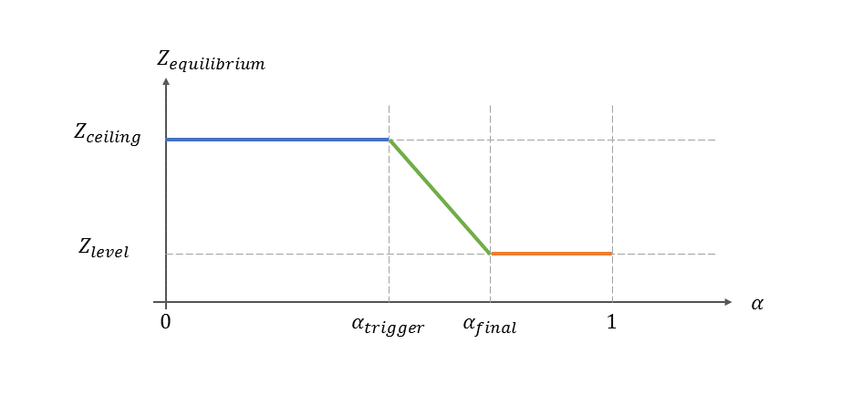

[](https://travis-ci.org/epfl-lasa/cpr_load_support)

# Load-Support controller

This repository provides a controller for a robotic arm to recieve a heavy load (with known mass) at a expected height and lower it down to a user-friendly height and carry it around. Moreover, the robot uses speech to notify the human-user with the state of the controller.

While generic in its approach, this specific impelementation is done for clearpath mobile-robot with UR5 robotic-arm. The only requirment (for other robots) is to have an impedance controller implemented. For our case at lasa, we are using our impelementation at [ridgeback_ur5_controllers](https://github.com/epfl-lasa/ridgeback_ur5_controller/tree/devel).


checklist:

- how to compile and run


- add a figure for the control structure


- name of topics and variable

- pictures and videos


## The control architecture

The architecture of the load-support architecture (which is impelemented [here](https://github.com/epfl-lasa/cpr_load_support/blob/master/src/LoadSupportController.cpp)) is depicted below.


### input-outpu
As you can see, the input signal to this code is the external force (F<sub>ext</sub>) and vision system information (published on ROS as transformation). The code outputs a desired equilibrium poin and a control wrench to the admittnace controller of the robot. The setting of these communication can be found in [the launch file](https://github.com/epfl-lasa/cpr_load_support/blob/master/launch/cpr_load_support.launch).

### Load-share computation
Based on the external forces on the z-axis (F<sub>ext,z</sub>) and the given mass for the object(M), the robot computes the load-share (noted as alpha). 

### Equilibrium computation
Based on the load-share and the location of the marker (which might be deteched from the object), the robot adapts its equilibrium point. The computation of the equilibrium point is done separately for z-xis and the x-y-plane. In the z-axis, the robot computes the equilibrium point using the follwoing function (noted as g).

This means, if the robot receives loads more than a certaion amount (alpha<sub>trigger</sub>) it will bring it down. Also, the robot holds the object at lower-level for load-share higher than (alpha<sub>final</sub>). In this graph, (Z<sub>ceiling</sub>) is the expected height to recieve the object and (Z<sub>level</sub>) is the final expected height. These parameters can be set from [the launch file](https://github.com/epfl-lasa/cpr_load_support/blob/master/launch/cpr_load_support.launch).


To compute the desired equilibrium in xy-plane, the robot considers the location of the object and load-share as follows. 
* If the maker is far, the robot ignore it and goes back to its resting equilibrium (whether it has the object or not).
* If the marker is in reach, the robot set the x-y of the equlibirum as the x-y of the object (filter and limited by the workspace).
** if the load-share is low, the robot tracks the marker in order to receive the object.
** if the load-share is high, the robot follows the marker in order to carry the object for the human-user.
* If the maker is very close the end-effector of the robot and the load-share is high enough, the robot tries to slowly bring the object to its resting equlibrium point.


---

## Compliation and build

Clone the repository intor your catkin source directory
```bash
$ cd ~/catkin_ws/src
$ git clone git@github.com:epfl-lasa/ridgeback_ur5_controller.git
```

Get the package dependencies using rosdep
```bash
$ rosdep install -y --from-paths src --ignore-src --rosdistro indigo
```

Finally complie
```bash
$ cd ~/catkin_ws
$ catkin_make
$ source devel/setup.bash
```


## Running the controller

In order to run this controller for ridgeback robot and LASA-vision system you need to run the followings:

ssh to the robot and run the following:
```bash
$ roslaunch cpr_bringup cpr_bringup.launch sim:=false
```
To learn how to ssh to the robot, check the wiki of the lab.


For the vision system, make sure your ros-mocap configurations (e.g., [this](https://github.com/epfl-lasa/ridgeback_ur5_controller/tree/devel/cpr_mocap_tracking/config))
```bash
$ roslaunch cpr_mocap_tracking cpr_object_tracking.launch
```
You can check the in rviz if a tf for the object is published w.r.t. to robot frames.


For the admittance controller:
```bash
$ roslaunch admittance_control admittance_controller_real.launch
```
Also make sure about your [admittance configurations](https://github.com/epfl-lasa/ridgeback_ur5_controller/blob/devel/admittance_control/config/admittance_params_real.yaml)

Finally, run the load-support controller
```bash
$ roslaunch cpr_load_support cpr_load_support.launch
```
